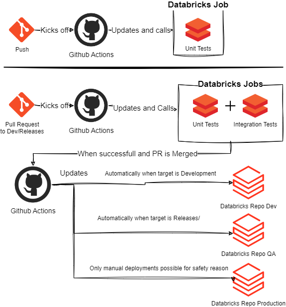

# Project Name

## Description

This repository contains an example of CI/CD could be approached in a notebook focussed way in Databricks using the [Nutter framework](https://github.com/microsoft/nutter) for a demo purposes. It's been heavily inspired by these two examples:

[databricks-nutter-repos-demo](https://github.com/alexott/databricks-nutter-repos-demo/tree/master)
and 
[dlt-files-in-repos-demo](https://github.com/alexott/dlt-files-in-repos-demo) both by Alex Ott

with the main difference being using GitHub Actions and Databricks Workflows instead of Azure DevOps.

It's main components are:
- GitHub Actions (for push/PR events, updating of the Databricks Workflows and calling the Databricks Jobs)
- Databricks Workflows to run the actual notebooks containing the unit tests (which are located in the tests/unit folder)
- Databricks Repos to mimic different workspaces/environments like Dev, QA and Prod for the CD part.

In the following image the basic flow is shown:


A major benefit of this setup is that you can see the runs of the unit tests from within the Databricks environment/UI in the Workflows section and see the actual code being run in a notebook fashion.

Now this unfortunately is not scalable because each unit test file results in an additional task which can grow into the 100's or 1000's or more. So for actual production usage i would suggest not creating a task per actual Unit Test notebook but to run them using the Nutter CLI. You might lose the visibility of the Databricks Workflows but gain scalability and still are able to use notebooks instead of Python files for unit testing.


## Prerequisites
To run this example you need:
- Databricks workspace 
- Terraform
- a Databricks PAT
- a GitHub PAT

## Usage
The easiest way is to use Terraform to deploy the required infrastructure to both Databricks and GitHub.

To do this first a local Terraform vars have to be created inside the terraform\github folder which contains the following vars:
- github_pat
- databricks_pat
- databricks_host (the link to your databricks workspace)
- github_url (the url of your github repository with this code)
- github_repo_name (the name of the github repo)


Then use the commandline to run the following commands from inside the terraform\github folder:
```bash
terraform init
terraform validate
terraform apply
```

This will setup the required infrastructure like a Databricks cluster (which is an All Purpose Compute cluster which is not suggested for use with jobs but is setup for demo purposes), GitHub Actions Environment Variables etc, they can all be found inside the various Terraform files.

Then when you create a feature branch from Development and you perform a code push the basic GitHub Action, "databricks-unit-test" is ran which will update the Databricks Workflow to point to your commit, create tasks for each notebook testing file and will run the Unit Tests located in that commit.

When you then create a Pull Request it will additionally run the Integration Tests in the tests/integration folder by way of the "databricks-integration-test" Action. At the moment these will fail to show the failure being propagated back to GitHub Actions so you can also see from GitHub when an Unit or Integration test has failed, to fix this you can remove the "plant_parsing.py" file.

When a Pull Request has been accepted and merged it will run another GitHub Action: "update-databricks-repos" which will then update the corresponding Databricks Repo to the new code (to mimic deploying to a workspace)


## Additional links
More information about CI/CD in Databricks can be found at the following links:

[Applying software development & DevOps best practices to Delta Live Table pipelines](https://www.databricks.com/blog/applying-software-development-devops-best-practices-delta-live-table-pipelines)

[CI/CD techniques with Git and Databricks Repos](https://docs.databricks.com/en/repos/ci-cd-techniques-with-repos.html)